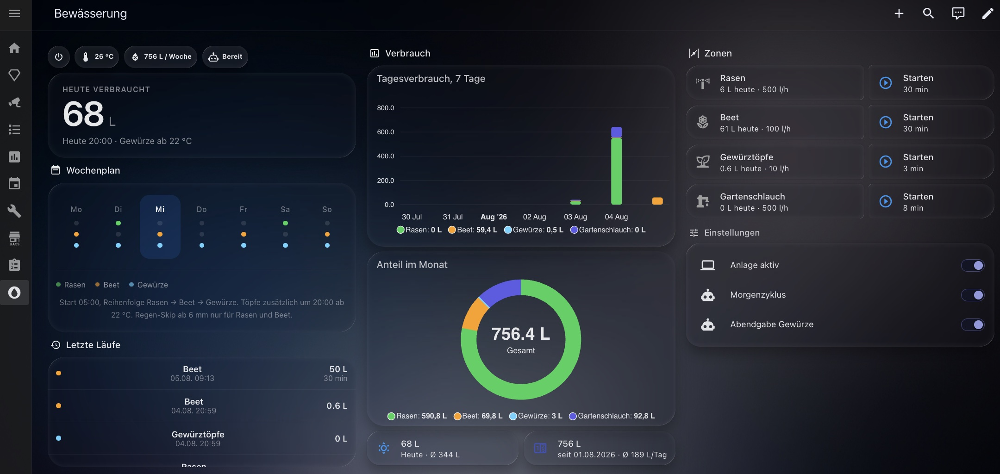

# Irrigation for Home Assistant

[![hacs][hacs-badge]][hacs-url]
[![ha][ha-badge]][ha-url]
[![license][license-badge]](LICENSE)

Complete irrigation control with litre-accurate consumption tracking **without a
flow sensor**, weather-dependent run times, a fault log, and a dashboard that
works on a phone as well as on a wall tablet.

**No YAML editing.** Rename your valve entities to match one naming convention
and configure everything else from the dashboard: flow rate, run time, which
zones exist, weather entity, weekly plan.



<sub>Screenshot taken with the [Frosted Glass Dark](https://github.com/wessamlauf/homeassistant-frosted-glass-themes)
theme. The dashboard does not depend on it — card radii, typography and the
water animation are set in the YAML — but the translucent panels and the
background gradient come from the theme, so a default theme will look flatter.</sub>

---

## The one thing you have to do

Rename your valve entities to:

```
switch.irrigation_zone_1
switch.irrigation_zone_2
...
switch.irrigation_zone_6
```

**Settings → Devices & services → Entities**, click the entity, change the
entity ID. Takes about a minute per zone.

**Why this cannot be avoided.** The `integration` and `utility_meter` platforms
resolve `source:` at configuration time, so the entity ID has to be written out
literally. A template is not allowed there, and no amount of helper entities
changes that. Renaming a handful of entities in the UI is the cheaper end of
that trade-off.

**What renaming breaks.** Any of your own automations, scripts or dashboards that
reference the old IDs. Home Assistant updates references inside UI-created
automations, but not inside YAML files. Check before you rename.

Zone display names come from the **friendly name** of the valve, so call them
whatever you like — Lawn, Beds, Herb pots. The dashboard follows.

---

## What it does

- **Consumption in litres without a flow sensor.** Run time multiplied by the
  flow rate you enter, integrated exactly.
- **Today, week, month and a freely chosen start date** as separate meters, all
  derived from the same source.
- **Weather-dependent run time** and a rain skip, both from the blueprints.
- **Rain skip preview.** From the evening on, the dashboard states whether
  tomorrow morning's run will be skipped.
- **Fault log.** Device unreachable, valve did not confirm the start, morning
  cycle produced no water, cycle flag stuck — each as a plain-language row.
- **Manual control per zone**, in parallel if you want, locked out while a cycle
  is running.
- **Six zone slots** out of the box, unused ones hide themselves. More or fewer:
  regenerate, see [Zone count](#zone-count).

---

## Architecture

There is exactly one source of truth. Everything derives from a single counting
sensor per zone.

```
switch.irrigation_zone_N            renamed by you
      |
      v
sensor.irrigation_zone_N_flow       0 or the rate from input_number
      |
      v
sensor.irrigation_zone_N_total      Riemann integral, method "left"
      |                             counts up forever, never reset
      +-------> utility_meter  today / week / month / since
      +-------> recorder history -> daily bar chart
```

**Why `method: left` is exact.** Flow is a step function jumping between zero and
the nominal rate. The left rectangle rule uses the value valid until the next
change, so this is the exact integral, not an approximation. The only error comes
from state reporting latency.

**Why there is no reset button.** A manual reset of the meters was the single
source of divergence between tiles and chart. Only the "since" meter is reset,
and only when the start date changes.

**Why the cycle interlock is a helper, not the automation state.** The blueprints
switch `input_boolean.irrigation_running` on for the duration of a cycle. Reading
an automation's own `current` attribute would mean hard-coding its entity ID,
which breaks the moment someone renames the automation. A watchdog clears the
flag after three hours in case a blueprint aborts mid-cycle.

---

## Requirements

| Item | Why |
|---|---|
| Home Assistant 2024.10 or newer | current automation and template syntax, `grid_options` |
| Valves exposed as `switch` entities | basis for control and measurement |
| A weather entity supporting `weather.get_forecasts` | temperature scaling and rain skip |

Frontend cards, all in HACS. All five are required — a missing one renders as a
red error block. Clear the browser cache once after installing.

| Card | Used for |
|---|---|
| [Mushroom](https://github.com/piitaya/lovelace-mushroom) | zone rows, tiles, chips |
| [card-mod](https://github.com/thomasloven/lovelace-card-mod) | radii, typography, spacing |
| [button-card](https://github.com/custom-cards/button-card) | hero, weekly plan, activity list |
| [apexcharts-card](https://github.com/RomRider/apexcharts-card) | bar chart, donut |
| [Bubble Card](https://github.com/Clooos/Bubble-Card) | zone pop-ups |

Optional, only for looks: the screenshot above uses the
[Frosted Glass Dark](https://github.com/wessamlauf/homeassistant-frosted-glass-themes)
theme, also available in HACS. Everything works without it.

---

## Installation

**0. Only if you need a different number of zones than six:** run the
generator first, see [Zone count](#zone-count). Six slots are pre-generated, so
most people skip this step entirely.

**1. Rename your valves** as described above.

**2. Package.** Copy `packages/irrigation.yaml` to `/config/packages/`. In
`configuration.yaml`:

```yaml
homeassistant:
  packages: !include_dir_named packages
```

The directory sits **next to** `configuration.yaml`, not under `www/` — anything
under `www/` is served without authentication.

**3. Restart**, then check **Developer tools → States**, filter `irrigation`.
You should see `sensor.irrigation_zone_1_total`, `sensor.irrigation_log`,
`binary_sensor.irrigation_running` and the helper entities.

**4. Dashboard.** New dashboard → three-dot menu → **Raw configuration editor**,
paste `dashboard/irrigation.yaml`.

**5. Fill in the setup card** at the bottom of the Zones column:

| Field | Example |
|---|---|
| Weather entity | `weather.home` |
| Weekly plan | `Mon:1,3\|Tue:2,3\|Wed:1,3\|Thu:3\|Fri:1,3\|Sat:2,3\|Sun:1,3` |
| Counting since | today's date |

Then open each zone pop-up (tap the zone row) and set **Zone in use** and
**Flow rate**.

**6. Blueprints.**

[![Import blueprint][import-badge]][import-cycle] Sequential cycle

[![Import blueprint][import-badge]][import-topup] Temperature triggered top up

Via HACS instead: **HACS → three-dot menu → Custom repositories**, add this
repository with category **Blueprint**.

> HACS has no category for packages or Lovelace dashboards, so those two are
> always a manual copy. The blueprints are the part it can install.

When creating the automation, the cycle flag and run-time helper inputs are
pre-filled with the entities from the package. Leave them as they are.

---

## Determining the flow rate

Put a bucket of known volume under the outlet, run the zone for one minute,
multiply litres by 60. For drip lines, multiply the number of emitters by their
rated output.

The rate does not have to be accurate to the litre — it has to be **stable**.
An unstable rate makes the meters and the chart drift apart, and neither can be
trusted afterwards.

---

## Zone count

Six slots are generated by default. Unused zones are hidden automatically once
`Zone in use` is off, so there is nothing to remove.

### Running the generator

Needed only for a zone count other than six. The script runs on your computer,
not inside Home Assistant.

**Prerequisites:** Python 3.9 or newer and PyYAML.

```bash
python3 --version          # 3.9 or newer
pip install pyyaml         # once
```

**Run it** from anywhere — output paths are resolved against the repository root,
not the current directory:

```bash
python3 tools/generate.py --zones 10
```

Output:

```
packages/irrigation.yaml: 10 zone slots, 2043 lines
dashboard/irrigation.yaml: 10 zone slots, 2681 lines
```

`python3 tools/generate.py --help` lists the options. `--package` and
`--dashboard` let you write elsewhere, for example straight into
`/config/packages/`.

**It overwrites both files without asking.** That is deliberate: they are output,
not configuration. Everything a user would want to change lives in helper
entities instead, so there is nothing in those files worth preserving. If you did
edit them by hand, commit first.

The upper bound is the length of `PALETTE` at the top of the script, currently
eight. Add more hex colours to go beyond that — one per zone, used for the chart
series and the coloured dots.

After regenerating: copy the package again, restart, and paste the new dashboard
into the raw configuration editor. Existing meter readings survive, because the
entity IDs of zones 1 to N do not change.

---

## Entities

Per zone, `N` is the slot number:

| Entity | Meaning |
|---|---|
| `switch.irrigation_zone_N` | your valve, renamed |
| `input_boolean.irrigation_zone_N_enabled` | zone in use |
| `input_number.irrigation_zone_N_rate` | flow rate in L/h |
| `input_number.irrigation_zone_N_duration` | manual run time |
| `sensor.irrigation_zone_N_flow` | 0 or the rate |
| `sensor.irrigation_zone_N_total` | counting, basis for everything |
| `sensor.irrigation_zone_N_today/week/month/since` | utility meters |
| `sensor.irrigation_zone_N_remaining` | remaining minutes |
| `sensor.irrigation_zone_N_name` | friendly name of the valve |
| `script.irrigation_zone_N_run` / `_toggle` | manual run, start/stop |

Global:

| Entity | Meaning |
|---|---|
| `input_boolean.irrigation_enabled` | master switch |
| `input_boolean.irrigation_running` | a cycle is running, set by the blueprints |
| `input_text.irrigation_weather` | weather entity |
| `input_text.irrigation_schedule` | weekly plan for the display card |
| `sensor.irrigation_water_today/week/month/since` | totals |
| `sensor.irrigation_log` | attribute `entries`, last 25 runs and faults |
| `sensor.irrigation_next_run` | text including the rain skip preview |
| `sensor.irrigation_rain_today/tomorrow/day_after` | forecast in mm |
| `binary_sensor.irrigation_running` | any valve is physically on |
| `script.irrigation_stop_all` | emergency stop |

---

## Troubleshooting

**Tiles show 0 L while the chart shows values.**
Orphaned entities from an earlier install still occupy the entity ID, so the new
one gets a `_2` suffix. Settings → Entities, filter status *Unavailable*, search
`irrigation`, delete them all, reload YAML.

**Everything stays at zero.**
Check `sensor.irrigation_zone_N_flow`. If it is 0 while the valve is on, either
`Zone in use` is off or the flow rate is unset.

**Start/stop reacts late or not at all.**
Cloud-based integrations report the switch state only on the next poll, typically
after 30 to 60 seconds. The cards therefore also evaluate
`script.irrigation_zone_N_run` and flip immediately. Run scripts use
`mode: restart`, so a repeated start is never silently dropped.

**Manual start says "Locked" but no cycle is running.**
`input_boolean.irrigation_running` is stuck, usually because a blueprint aborted.
The watchdog clears it after three hours and writes a log entry; you can also
switch it off by hand.

**The activity list stays empty.**
The store is the entity's own attribute, and reloading template entities can
clear it. To test without waiting for a run: **Developer tools → Events**, event
type `irrigation_fault`, data `{"zone": "Test", "text": "Test entry"}`.

**Cannot scroll inside the activity list.**
button-card attaches an action handler to the whole card that swallows the swipe
gesture. The card is set to `pointer-events: none` and only the list field
accepts input.

**Chart legend shows "Zone 1" instead of the name.**
apexcharts-card resolves series names at configuration time and cannot template
them. The zone rows, pop-ups and log use the real names.

---

## Known limitations

- **No real flow sensor.** A dripping or partly blocked outlet goes unnoticed,
  because the volume is calculated rather than measured.
- **Accuracy depends on state reporting.** With a cloud integration polling every
  60 seconds, each run drifts by up to a minute. On a three-minute zone that is
  more than 30 percent.
- **Valves opened in parallel** share the line pressure and the configured rates
  no longer hold. The blueprint cycle therefore runs sequentially.
- **The weekly plan card is display only** and has to be kept in sync with the
  blueprints by hand.
- **The rain skip preview can flip.** It is computed in the evening, the cycle
  decides in the morning with a newer forecast.
- **The bar chart reaches back as far as `purge_keep_days`**, ten days by
  default, because it reads recorder history to stay immediate.
- **Equal column heights** cannot be enforced in the sections view, only
  approximated by distributing cards.

---

## Contributing

Issues and pull requests welcome. If you adapt this to a different irrigation
controller, a note on which entities it exposes is genuinely useful — the valve
plus number-entity pattern is not universal.

## License

MIT, see [LICENSE](LICENSE).

<!-- Replace strikecom/ha-irrigation throughout before publishing -->
[hacs-badge]: https://img.shields.io/badge/HACS-Custom-41BDF5.svg
[hacs-url]: https://hacs.xyz/
[ha-badge]: https://img.shields.io/badge/Home%20Assistant-2024.10%2B-41BDF5.svg
[ha-url]: https://www.home-assistant.io/
[license-badge]: https://img.shields.io/badge/license-MIT-blue.svg
[import-badge]: https://my.home-assistant.io/badges/blueprint_import.svg
[import-cycle]: https://my.home-assistant.io/redirect/blueprint_import/?blueprint_url=https%3A%2F%2Fgithub.com%2Fstrikecom%2Fha-irrigation%2Fblob%2Fmain%2Fblueprints%2Fautomation%2Firrigation%2Fsequential_cycle.yaml
[import-topup]: https://my.home-assistant.io/redirect/blueprint_import/?blueprint_url=https%3A%2F%2Fgithub.com%2Fstrikecom%2Fha-irrigation%2Fblob%2Fmain%2Fblueprints%2Fautomation%2Firrigation%2Ftemperature_top_up.yaml
